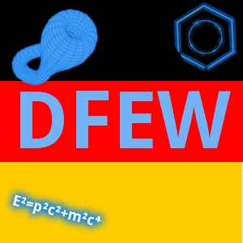

## Current status

As of now this extension is not actively maintained. Although it should work with the recent versions of LibreOffice and OpenOffice, the actual dictionary has not received updates since more than 10 years :(

__If you are interested in continuing this project, feel free to fork it!__

## Description
Deutsches Fachspezifische Ergänzungswörterbuch (DFEW) enthält ca. 81.000 Fachbegriffe aus Mathematik, Physik, Chemie, Lebenswissenschaften, IT, Technik, Industrie, Geowissenschaften usw. Derzeitige Schwerpunkte sind Mathematik und Physik. Die Benutzung von DFEW setzt voraus, dass auf Ihrem Rechner bereits das de-DE-frami-Wörterbuch von Franz Michael Baumann installiert ist, da DFEW nur solche Einträge enthält, die in de-DE-frami fehlen.

 - über 81.000 Einträge mit über 292.000 daraus abgeleiteten Wortformen (Flexionen und Konjugationen)
 - drei und Open Source (LGPLv3)


German Specialist Supplemental Dictionary (DFEW) contains about 81,000 terms from such fields as mathematics, physics, chemistry, life sciences, IT, engineering, industry, Earth science etc. Currently, most entries are related to mathematics and physics. If you want to use it, you have to make sure that you already have installed the de-DE-frami dictionary by Franz Michael Baumann installed. This is because DFEW contains only terms missing in de-DE-frami.

 - more than 81,000 single entries with more than 292,000 derivable word forms (inflected and conjugated)
 - free and Open Source (LGPLv3)

## Building

Just clone this repository, zip up the files inside the `Extension` subdirectory and change the extension of the resulting file to `.oxt`, e.g.

```
git clone https://github.com/vsht/DFEW.git
cd dfew/Extension
zip -r dfew.zip *
mv dfew.zip dfew.oxt
```
## Installing

Install the `.oxt` file via the extension manager of LibreOffice or OpenOffice.


## Licensing 
Copyright (C) 2009-2022 Vladyslav Shtabovenko

DFEW is licensed under LGPLv3
A copy of the LGPLv3 license is included as Extension/COPYING.LESSER. According to the FSF (http://www.gnu.org/licenses/gpl-howto.html), a software licensed under LGPLv3 should also include a copy of the GPL.
A copy of the GPL license is included as Extension/COPYING.
